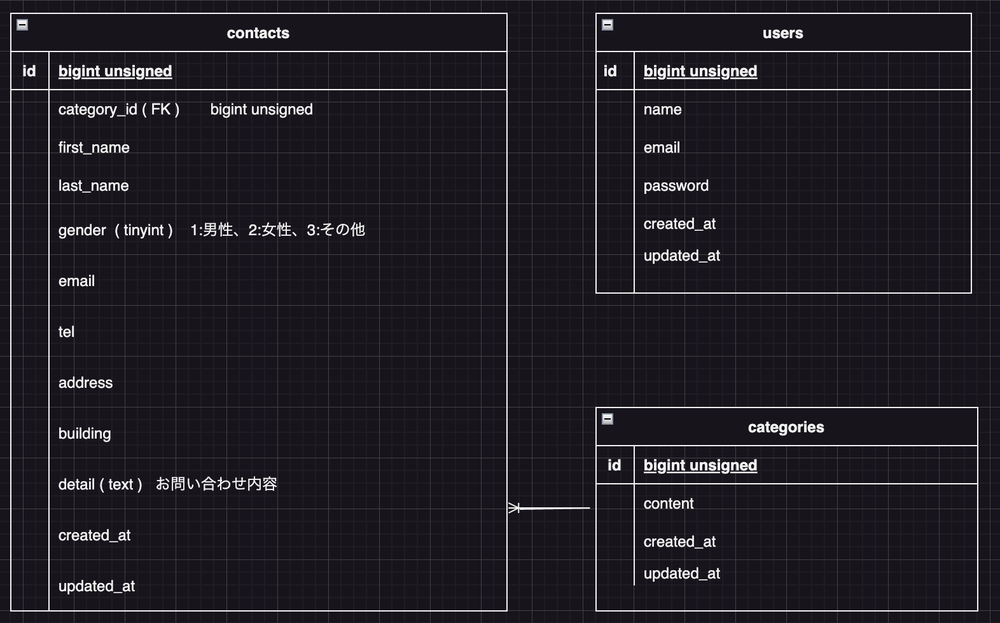

# アプリケーション名
FashionablyLate（お問い合わせフォーム）

## 環境構築

### Dockerビルド
1. リポジトリをクローン
```bash
git clone https://github.com/kn-a0322/test-contact-app.git
cd test-contact-app
```

2. Dockerコンテナを起動
```bash
docker-compose up -d --build
```

### Laravel環境構築
1. PHPコンテナに入る
```bash
docker-compose exec php bash
```

2. Composer依存関係をインストール
```bash
composer install
```

3. 環境変数ファイルを作成
```bash
cp .env.example .env
```
※環境変数は適宜変更してください

4. アプリケーションキーを生成
```bash
php artisan key:generate
```

5. マイグレーションを実行
```bash
php artisan migrate
```

6. シーディングを実行
```bash
php artisan db:seed
```

## 開発環境
- **お問い合わせ画面**: http://localhost/
- **ユーザー登録**: http://localhost/register
- **phpMyAdmin**: http://localhost:8080/

## 使用技術（実行環境）
- PHP 8.2.11
- Laravel 8.83.8
- jQuery 3.7.1.min.js
- MySQL 8.0.26
- nginx 1.21.1

## ER図


### テーブル構成
- **contacts**: お問い合わせ情報
- **categories**: お問い合わせの種類
- **users**: ユーザー情報

## URL
- **GitHubリポジトリ**: https://github.com/kn-a0322/test-contact-app
- **開発環境**: http://localhost/
